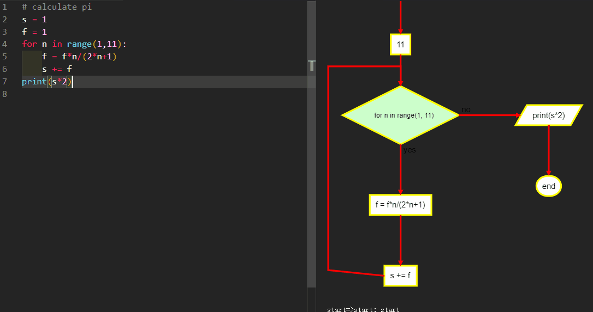

# py2flowchart
Convert python code to flowchart.
Please upgrade the py2flowchart to the latest version.
`pip install -U py2flowchart`.

## How to use
> Tip: `F1` or `Ctrl+Shift+P`, select `flowchart: Open flowchart`
> right-click, 'open flowchart'


## Requirements
- Python3.7+.
- pip install py2flowchart

## Extension Settings
```json
    "py2flowchart.style": {
        "line-color": "red",
        "element-color": "brown",
        "fill": "yellow",
        "flowstate": {
            "past": {
                "fill": "#CCCCFF",
                "font-size": 12
            }
        }
    },
```

### 0.0.3
Input and output nodes use trapezoid.

### 0.0.2
Fix bugs for windows. 

### 0.0.1
Initial release.  

## Known Issues
Only simple python code is supported.     
`break` and `continue` as simple statement.  
please contact: dstang2000@263.net


